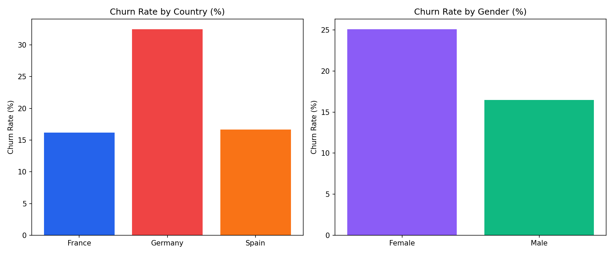
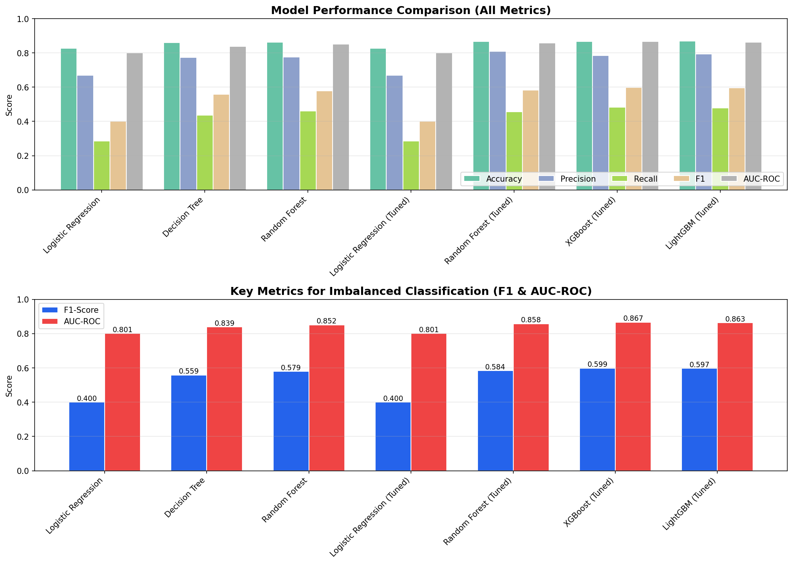
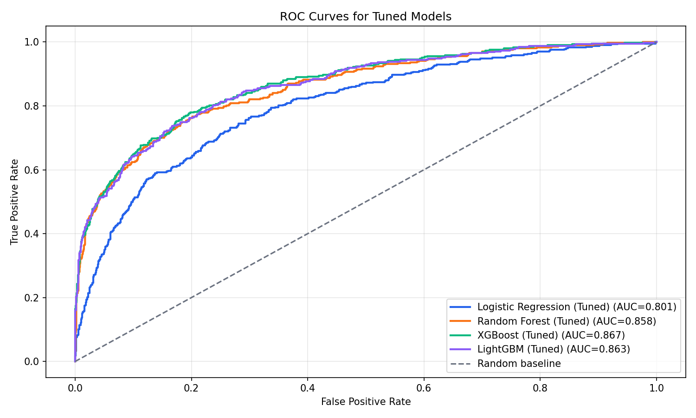
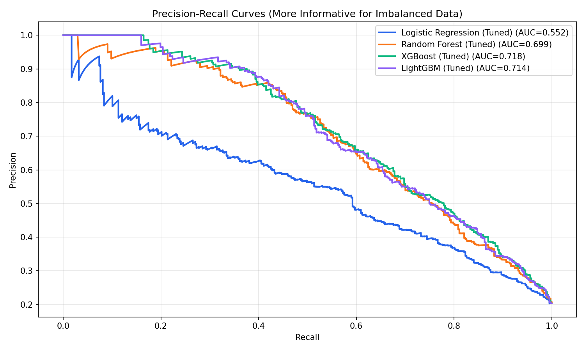

# Bank Customer Churn Prediction

**Presentation video:** Paste the final YouTube recording link here before submission.

## How To Build And Run

Run these commands from the repository root:

```bash
make install
make build
```

`make install` installs all Python dependencies from `requirements.txt`. `make build` runs the automated tests and generates the interactive dashboard at `visualizations/churn_dashboard.html`.

To reproduce the full notebook analysis and model outputs:

```bash
make notebook
```

Useful commands:

```bash
make test        # run the pytest suite
make dashboard   # regenerate visualizations/churn_dashboard.html
make notebook    # execute churn pipeline.ipynb with nbconvert
make clean       # remove generated caches/dashboard output
```

If `make` is not available on your machine, use the equivalent Python commands:

```bash
python -m pip install -r requirements.txt
python -m pytest -q
python -m src.make_dashboard --input Churn_Modelling.csv --output visualizations/churn_dashboard.html
python -m jupyter nbconvert --to notebook --execute --inplace "churn pipeline.ipynb"
```

The dataset file `Churn_Modelling.csv` must be present in the repository root.

## Project Overview

This project predicts whether a bank customer will churn using customer demographics, account information, product usage, and activity indicators. The task is binary classification: `Exited = 1` means the customer churned, and `Exited = 0` means the customer stayed.

The project follows the full data science lifecycle required for CS506:

- Data collection
- Data cleaning
- Feature extraction
- Data visualization
- Model training
- Model evaluation and interpretation

The main analysis is in `churn pipeline.ipynb`. Reusable cleaning, feature engineering, modeling, and dashboard code lives in `src/` so the project can also be tested and run from the command line.

## Repository Organization

```text
.
|-- .github/workflows/tests.yml        # GitHub Actions test workflow
|-- Churn_Modelling.csv                # Raw collected dataset
|-- Makefile                           # Reproducible build/test commands
|-- README.md                          # Final project report
|-- requirements.txt                   # Python dependencies
|-- churn pipeline.ipynb               # Main end-to-end analysis notebook
|-- src/
|   |-- __init__.py
|   |-- churn_pipeline.py              # Data loading, cleaning, features, model helpers
|   `-- make_dashboard.py              # Interactive dashboard generator
|-- tests/
|   `-- test_churn_pipeline.py         # Core pytest checks
|-- visualizations/
|   `-- churn_dashboard.html           # Generated interactive dashboard
`-- *.png                              # Notebook-generated figures
```

## Data Collection

The project uses the public `Churn_Modelling.csv` bank customer churn dataset. The dataset was collected as a CSV file and committed to the repository so results are reproducible without API keys, external scraping, or private credentials.

The collection/loading step is implemented in `src/churn_pipeline.py` through `load_raw_data`, which reads the CSV used by the notebook, dashboard, and tests.

## Data Cleaning

The raw dataset has 10,000 rows and 14 columns. Cleaning removes identifier columns that should not be used for prediction:

- `RowNumber`
- `CustomerId`
- `Surname`

The cleaning code also removes duplicate rows, standardizes categorical text, and defensively fills numeric/categorical missing values. The provided dataset has no missing values after cleaning. Cleaning is implemented in `src/churn_pipeline.py` and used by both the tests and dashboard.

## Feature Extraction

The model uses the original customer/account columns plus 4 engineered features:

- `Balance_Income_Ratio`
- `Products_Per_Tenure`
- `Balance_Product_Interaction`
- `Senior_Citizen_Age`

These features represent account intensity, product usage over tenure, balance/product interaction, and senior-customer effects. Earlier duplicate or highly correlated candidates were removed: `Is_Active`, `Has_Credit_Card`, `Age_Squared`, `Salary_Per_Product`, `Zero_Balance`, and `High_Balance`. This keeps the correlation matrix cleaner and avoids adding features that mostly repeat existing variables. Feature extraction is implemented in `src/churn_pipeline.py` and in the notebook.

## Visualization

The notebook generates final-quality static visualizations:

- Categorical churn patterns by geography/gender/activity/product count
- Age distribution for churned vs. retained customers
- Correlation heatmap
- Model comparison chart
- ROC curves
- Precision-recall curves
- Confusion matrices
- Feature importance
- Learning curves

The project also includes an interactive HTML dashboard generated by:

```bash
make dashboard
```

Dashboard output: `visualizations/churn_dashboard.html`.









## Modeling

The notebook compares several classification models:

- Logistic Regression
- Decision Tree
- Random Forest
- Tuned Logistic Regression
- Tuned Random Forest
- Tuned XGBoost
- Tuned LightGBM

Preprocessing uses `StandardScaler` for numeric features and `OneHotEncoder` for categorical features (`Geography`, `Gender`). The train/test split is stratified so the churn rate is preserved in both sets. Hyperparameter tuning uses `GridSearchCV` with 5-fold cross-validation and F1-score as the optimization metric. SMOTE is explored only on the training data to avoid leaking synthetic examples into the test set.

F1-score and AUC-ROC are the main metrics because the dataset is imbalanced: 2,037 out of 10,000 customers churned, or 20.4%.

## Results

After removing redundant/high-correlation engineered features, XGBoost was the strongest model by F1-score, AUC-ROC, and recall.

| Result | Model | Value |
|---|---|---:|
| Best F1-score | XGBoost (Tuned) | 0.599 |
| Best AUC-ROC | XGBoost (Tuned) | 0.867 |
| XGBoost accuracy | XGBoost (Tuned) | 86.8% |
| XGBoost precision | XGBoost (Tuned) | 78.5% |
| XGBoost recall | XGBoost (Tuned) | 48.4% |
| XGBoost cross-validation F1 | XGBoost (Tuned) | 0.589 +/- 0.026 |

At a 0.50 classification threshold, XGBoost flagged 251 customers as likely churners. Of those, 197 were true churners and 54 were false positives, giving 78.5% precision among flagged customers.

Key data findings:

- Overall churn rate is 20.4%.
- Germany has the highest churn rate at 32.4%.
- Female customers have a higher churn rate than male customers in this dataset, 25.1% vs. 16.5%.
- Churned customers are older on average: 44.8 years old vs. 37.4 for retained customers.
- Inactive customers churn more often than active customers, 26.9% vs. 14.3%.
- Customers with 3 or 4 products have very high churn rates, though those groups are small.

These results meet the project goal: the model identifies a meaningful high-risk customer segment, and the visualizations explain which customer attributes are most associated with churn.

## Testing And Continuous Integration

Tests are in `tests/test_churn_pipeline.py`. They check that:

- The dataset loads correctly.
- Cleaning removes identifier columns and produces no missing values.
- Feature engineering creates the expected derived columns without mutating the input data.
- Removed duplicate/high-correlation feature candidates are not recreated, and retained engineered features stay below a 0.90 absolute-correlation threshold against original numeric predictors.
- A baseline training pipeline returns valid classification metrics.

The GitHub Actions workflow in `.github/workflows/tests.yml` runs on pushes and pull requests:

```bash
make install
make test
```

This satisfies the requirement that the repository define a GitHub workflow to test important code paths.

## Supported Environment

This project targets Python 3.11. GitHub Actions tests it on Ubuntu. The same Python commands also run on Windows; if Windows does not have `make`, use the Python command equivalents listed at the top.

## How To Contribute

Create a branch, make focused changes, and run `make test` before opening a pull request. If a change affects plots, modeling, or the dashboard, also run `make dashboard` or `make notebook` to regenerate the relevant outputs.

## Limitations And Future Work

The dataset is a static historical sample, so it does not capture time-series customer behavior, recent support interactions, pricing changes, marketing campaigns, or macroeconomic conditions. A production version should validate performance over time, monitor model drift, tune the classification threshold based on retention capacity, and test retention actions with an A/B experiment.
