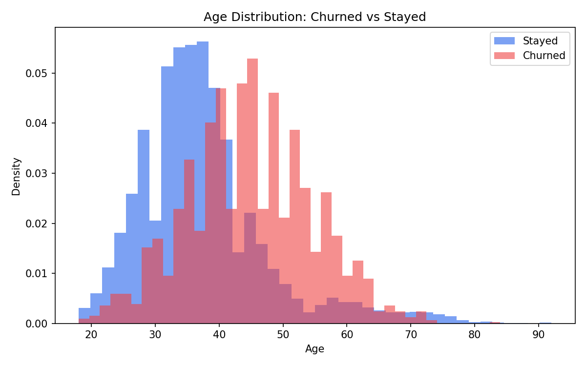
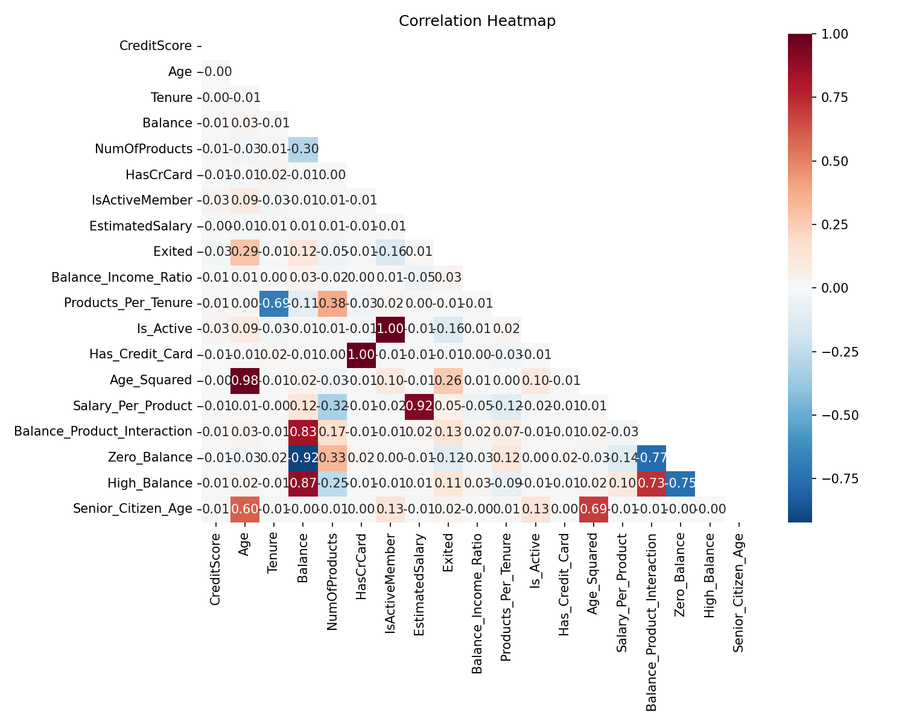
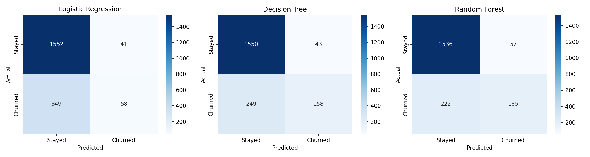
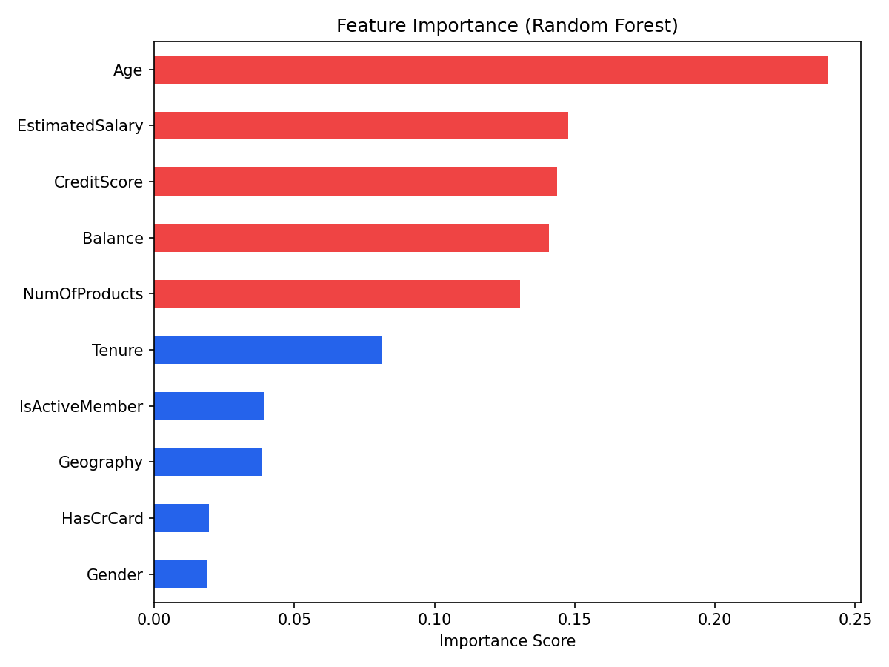
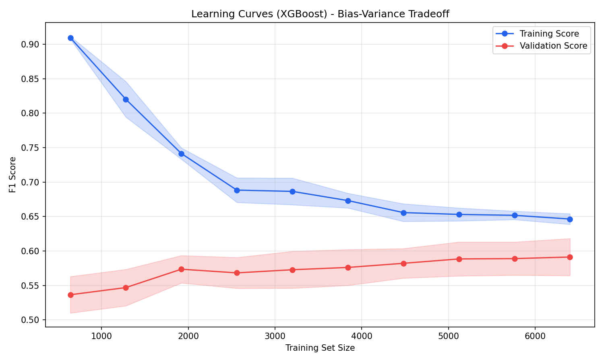

# Bank Customer Churn Prediction

**Presentation video:** TODO: replace this with the YouTube recording link before submission.

## How To Build And Run

This project uses a Makefile so the results can be reproduced from a fresh checkout.

```bash
make install
make build
```

`make install` installs the Python dependencies in `requirements.txt`. `make build` runs the automated tests and generates the interactive dashboard at `visualizations/churn_dashboard.html`.

Useful individual commands:

```bash
make test        # run the pytest test suite
make dashboard   # build the interactive HTML dashboard
make notebook    # execute the full modeling notebook with nbconvert
```

To inspect or rerun the full analysis interactively:

```bash
jupyter notebook "churn pipeline.ipynb"
```

The main dataset file, `Churn_Modelling.csv`, must be present in the project root.

## Project Goal

The goal is to predict which bank customers are likely to churn so the bank can target retention campaigns before losing those customers. The model is optimized around F1-score and AUC-ROC because the churn class is imbalanced: only about 20.4% of customers exited.

The business framing used in the notebook is:

- Retention campaign cost: `$500` per targeted customer
- Customer lifetime value: `$10,000`
- Objective: identify high-risk customers accurately enough that targeted retention produces positive net value

## Data Processing And Modeling

The raw dataset contains 10,000 customers and 14 columns. The notebook drops identifier columns (`RowNumber`, `CustomerId`, `Surname`) before modeling, leaving 11 modeling columns including the target, `Exited`.

Feature engineering adds 10 domain features:

- `Balance_Income_Ratio`
- `Products_Per_Tenure`
- `Is_Active`
- `Has_Credit_Card`
- `Age_Squared`
- `Salary_Per_Product`
- `Balance_Product_Interaction`
- `Zero_Balance`
- `High_Balance`
- `Senior_Citizen_Age`

Preprocessing uses `StandardScaler` for numeric features and `OneHotEncoder` for categorical features (`Geography`, `Gender`). The train/test split is stratified, and SMOTE is applied only to the training data in the full notebook to reduce class imbalance without leaking synthetic examples into the test set.

Models evaluated:

- Logistic Regression
- Decision Tree
- Random Forest
- Tuned Logistic Regression
- Tuned Random Forest
- Tuned XGBoost
- Tuned LightGBM

The tuned models use `GridSearchCV` with 5-fold stratified cross-validation and F1-score as the optimization metric.

## Results

The best-performing model in the notebook is **XGBoost (Tuned)**.

| Metric | Value |
|---|---:|
| Test Accuracy | 86.8% |
| Test F1-Score | 0.599 |
| Test AUC-ROC | 0.869 |
| Cross-Validation F1 | 0.591 +/- 0.027 |

At the default churn probability threshold of `0.5`, the model identifies:

- High-risk customers: `254`
- True positives: `198`
- False positives: `56`
- Precision on targeted customers: `77.6%`

Using the business assumptions above:

| Business Metric | Value |
|---|---:|
| Retention campaign cost | $127,000 |
| Customer lifetime value protected | $1,980,000 |
| Net benefit | $1,853,000 |
| ROI | 1459.1% |

These results show that the project achieved its goal: the model identifies a small high-risk segment with enough precision to make targeted retention financially worthwhile.

## Visualizations

The project includes both saved notebook figures and an interactive dashboard.

Interactive:

- `visualizations/churn_dashboard.html` generated by `make dashboard`

Static figures:













## Testing And Continuous Integration

The project includes pytest tests in `tests/test_churn_pipeline.py`. They check that:

- The dataset loads correctly and identifier columns are removed
- Feature engineering creates the expected columns without mutating the input data
- A baseline training pipeline can fit and produce valid classification metrics

The GitHub Actions workflow in `.github/workflows/tests.yml` runs:

```bash
make install
make test
```

This keeps the test command consistent between local development and GitHub CI.

## Repository Structure

```text
.
├── .github/workflows/tests.yml
├── Churn_Modelling.csv
├── Makefile
├── README.md
├── requirements.txt
├── churn pipeline.ipynb
├── src/
│   ├── __init__.py
│   ├── churn_pipeline.py
│   └── make_dashboard.py
├── tests/
│   └── test_churn_pipeline.py
└── *.png
```

## Main Business Recommendations

Focus retention outreach on customers flagged as high risk, especially customers with patterns associated with churn in the analysis: older age, lower engagement, fewer products, low activity, and geography/gender segments with elevated churn rates.

The current threshold already produces strong positive ROI, but the bank should tune the decision threshold based on campaign capacity. A lower threshold increases recall and catches more churners; a higher threshold increases precision and reduces wasted retention spend.

## Limitations And Future Work

The dataset is historical and does not include recent macroeconomic or customer interaction data. A production version should add temporal validation, monitor model drift, retrain on recent customer behavior, and A/B test retention campaigns to measure actual saved revenue.
